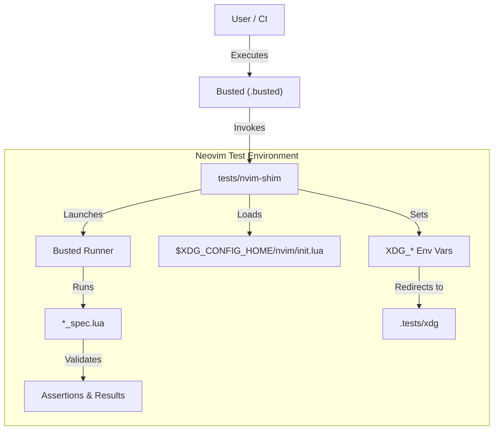

# 🛠️ Developer documentation

This is a documentation file for developers.

## Dev environment setup

This project requires the following tools:

- [Commitlint]
- [Just]
- [Lefthook]
- [LuaRocks]
- [Lychee]
- [Stylua]

Run the initialization script:

```shell
just init
```

## Ops

### Testing

To generate and open a test coverage report:

```shell
rm luacov.stats.out && just test && just generate-test-coverage-report && open luacov-html/index.html
```

### Version release & distribution

1. Cut off a version in `CHANGELOG.md` by moving the content of “Unreleased” to
   “TBR —\<date\>”.
1. Bump the version with a commit & tag:
   `just bump`.
1. Release the version commit & tag:
   `just push-current-version`.

## Test setup

This section explains how the testing harness works.
The whole setup uses Busted as the test runner and DSL for tests.

`busted` is configured by `.busted`.
It effectively launches `tests/nvim-shim BUSTED_RUNNER`.

`nvim-shim` sets up and exports configuration variables that isolate Neovim’s
configuration to one in `.tests/xdg`.
It also uses `tests/init.lua` for the setup.

Within that Neovim/Lua environment `BUSTED_RUNNER` runs `*_spec.lua` scripts.

Some spec files go a bit further and launch a remote-controlled Neovim to run
test code in isolation.
That remote-controlled Neovim inherits the config variables.
Assertions are still done in the `nvim-shim` environment though.



### Coverage

We initialize Luacov in Neovim’s init.lua.
Initializing Luacov in the most outer layer, Busted, didn’t work — Luacov wasn’t
accurately capturing tested code.
