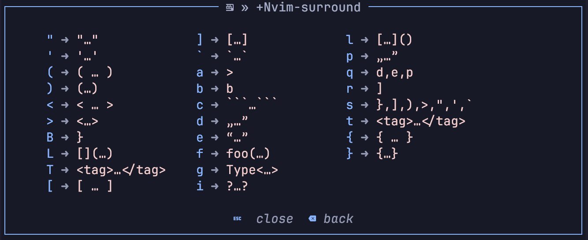

<!-- markdownlint-disable MD013 MD033 MD041 -->

<div align="center">
  <p>
    <h1>nvim-surround-wk</h1>
  </p>
  <p>
    A Neovim plugin that adds Which Key support for nvim-surround.
  </p>
  <p>
    
  </p>
</div>

nvim-surround-wk is a Neovim plugin that integrates [nvim-surround] with
[Which Key] to provide rich keymap visual hints for adding, modifying, and
deleting surrounds.

## ⚡️ Requirements

- Neovim 0.11+
- Required plugin dependencies:
  - [nvim-surround]
    ([> v4.0.5 or HEAD](https://github.com/kylechui/nvim-surround/commit/8b47db616ef658b8fc27e61db2896aa2f40134de))
  - [Which Key]

## 📦 Installation

Install the plugin with your preferred package manager, such as [Lazy]:

```lua
{
  "gregorias/nvim-surround-wk",
  config = true,
}
```

## 🚀 Usage

Nvim-surround-wk uses a `label` in a surround definition.
Nvim-surround comes with labels for its built-in surrounds.
For user-defined surrounds, you need to provide the label field like so:

```lua
require"nvim-surround".buffer_setup{
  surrounds = {
    ["$"] = {
      add = { "${", "}" },
      find = "$%b{}",
      delete = "^(..)().-(.)()$",
      label = "${…}"
    },
  }
}
```

## Limitations

- All available surrounds need to be preconfigured.
  Which Key doesn’t process unconfigured triggers.
- Can’t use the space character as a trigger.
  This is probably a Which Key bug/limitation.

[nvim-surround]: https://github.com/kylechui/nvim-surround
[Which Key]: https://github.com/folke/which-key.nvim
[Lazy]: https://github.com/folke/lazy.nvim
